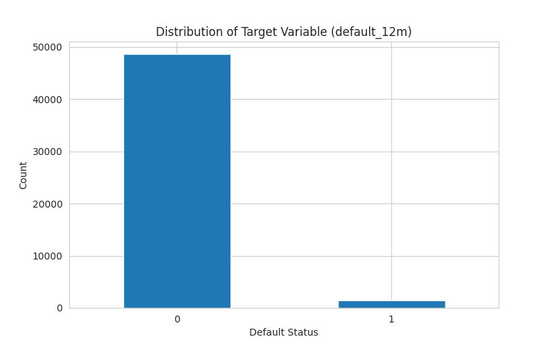
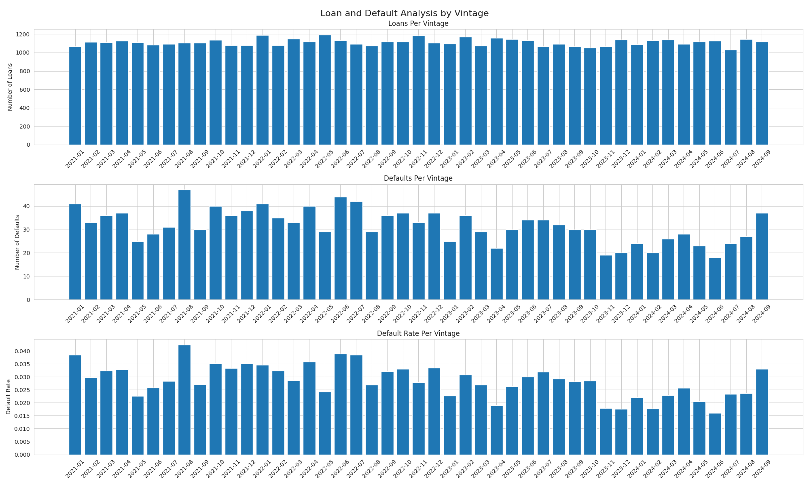
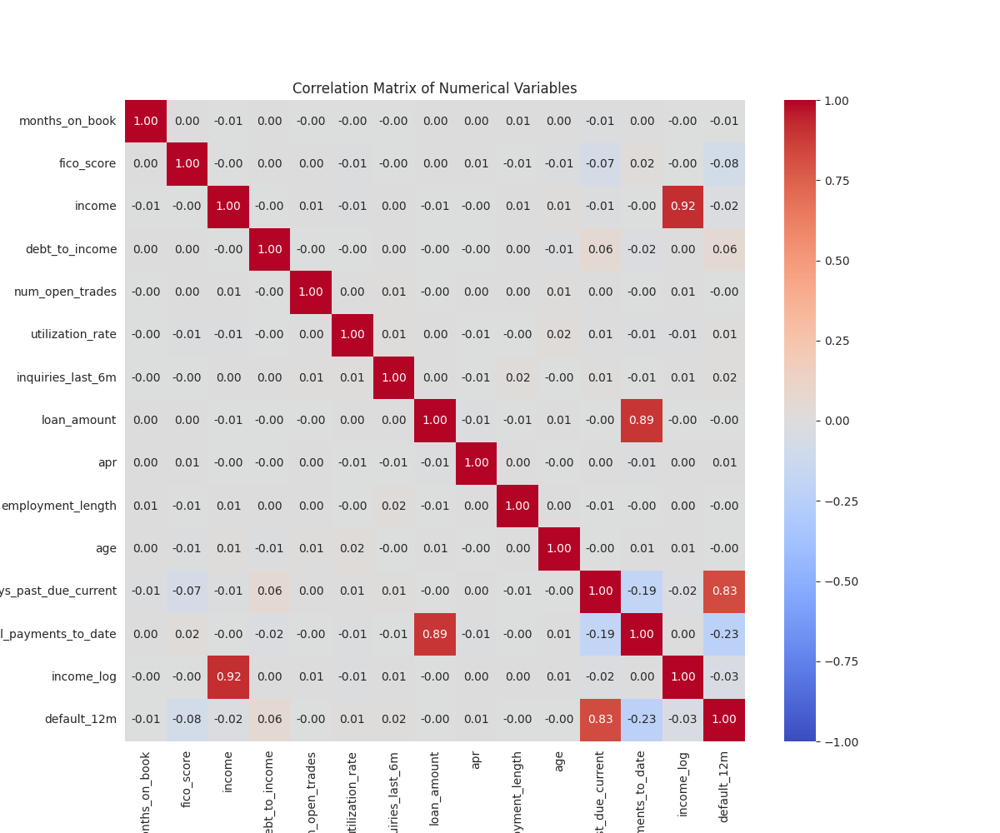
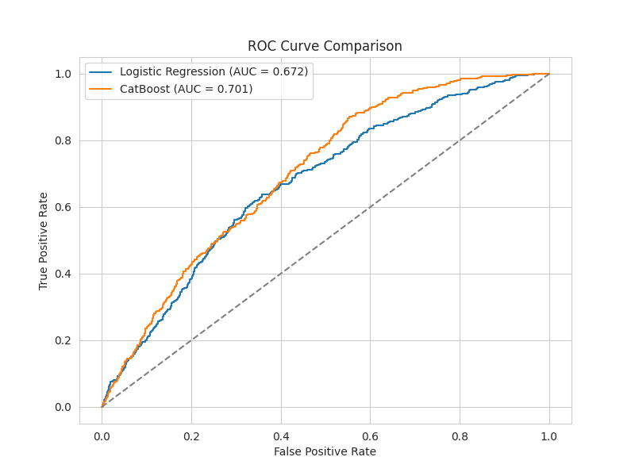
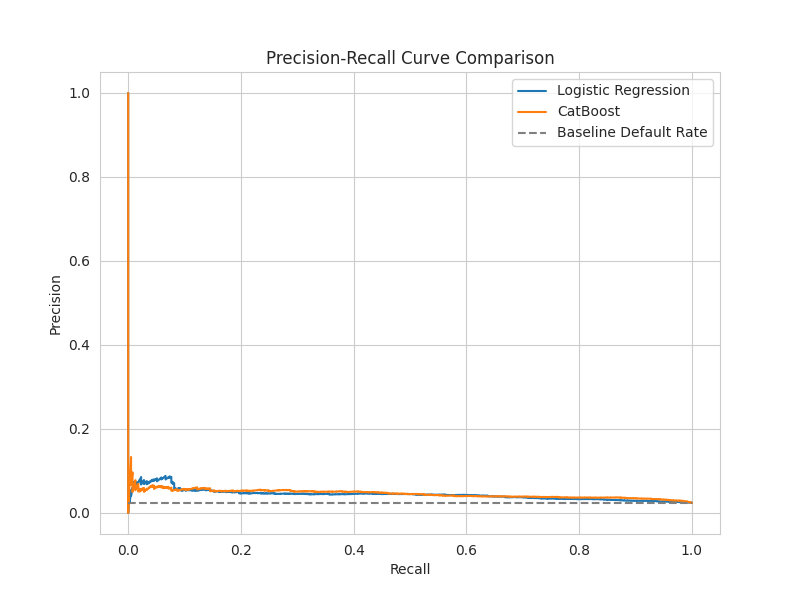
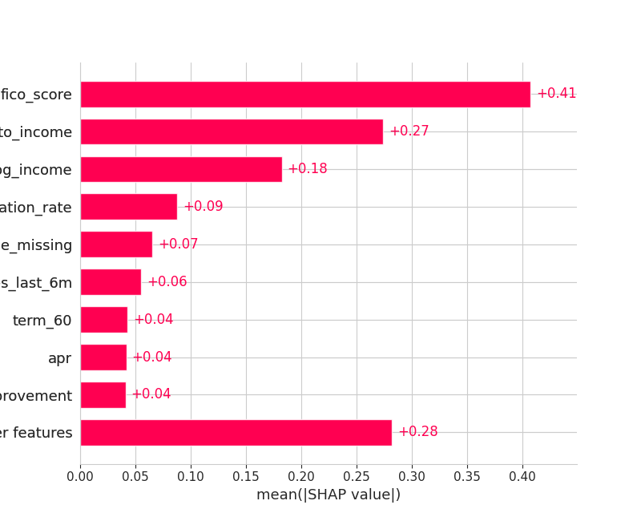
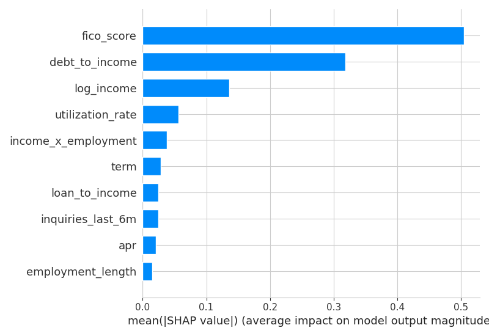
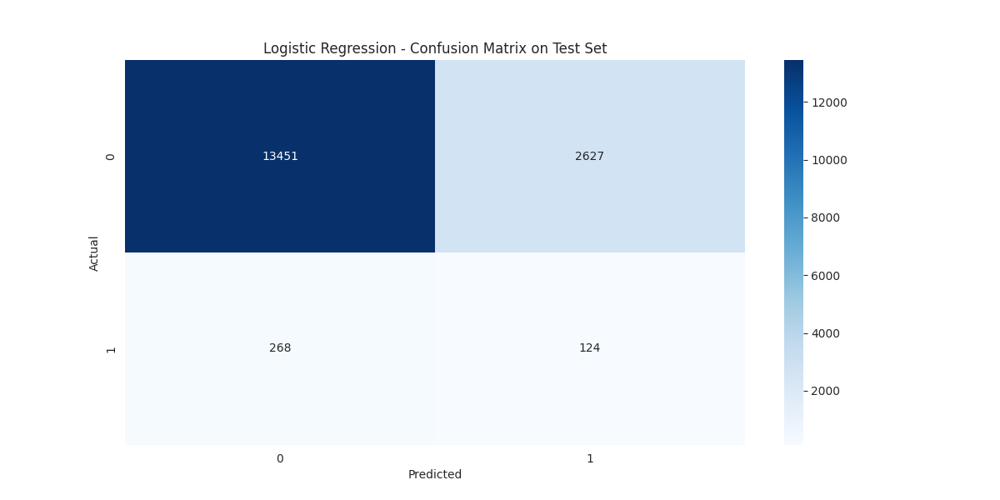
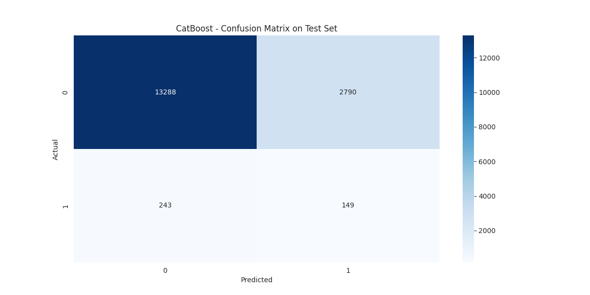

# Loan Default Risk Prediction

Lenders need to identify higher-risk borrowers before losses occur, not after. This project builds and end-to-end default risk pipeline predicting 12-month loan default using borrower, loan, credit, and pricing features from a private loan-level dataset of 50K originations spanning January 2021 to September 2024. It compares a regularized Logistic Regression baseline with a tuned CatBoost model, evaluates performance under severe class imbalance (3% default rate), and uses SHAP to interpret the key drivers of default risk.

> **Note:** The dataset is proprietary and not publicly redistributable. The modeling workflow, evaluation code, and visualizations are included for review purposes.

**[Modeling notebook](notebooks/modeling.ipynb)**

---

## Results

Two models were evaluated on a held-out test set using both threshold-independent metrics, such as ROC-AUC and KS statistic, and threshold-dependent metrics, such as precision, recall, and F1-score. This is important because the target class is highly imbalanced, with defaults representing approximately 3% of observations.

| Model               | Threshold |    ROC-AUC |  Precision |     Recall |   F1-score | KS Statistic |
| ------------------- | --------: | ---------: | ---------: | ---------: | ---------: | -----------: |
| Logistic Regression |      0.05 |     0.6722 |     0.0451 |     0.3163 |     0.0789 |       0.2792 |
| **CatBoost** ✓      |  **0.05** | **0.7009** | **0.0507** | **0.3801** | **0.0895** |   **0.3190** |

`CatBoost` demonstrated the strongest performance across all reported test metrics. It achieved higher ROC-AUC and KS statistic, indicating better separation between default and non-default score distributions. At the selected threshold, CatBoost also captured more true defaults than Logistic Regression while maintaining slightly higher precision and F1-score.

Although absolute precision remains low due to the rare default class, CatBoost provides the stronger risk-ranking and screening model for identifying higher-risk loans.

---

## Why This Problem

Loan default prediction is a high-impact classification problem because lenders need to identify higher-risk borrowers before losses occur. In this setting, the positive class is rare, so accuracy is not a useful primary metric. A model can achieve high accuracy by predicting nearly every loan as non-default, while still failing to identify the borrowers most likely to default.

This project focuses on ranking and screening performance rather than raw accuracy. Metrics such as ROC-AUC, precision-recall behavior, recall, F1-score, and KS statistic provide a more meaningful view of how well the model separates risky loans from lower-risk loans.

<p align="center">
  
</p>

---

## Exploratory Analysis

The dataset shows a severe class imbalance, with defaults representing only a small share of total loans. This imbalance directly influenced the modeling strategy, metric selection, and threshold tuning process.

A vintage-based review was also used to understand how loan originations and default behavior vary across time. This supported the decision to use non-overlapping time-based train, validation, and test splits rather than a purely random split.

<p align="center">
  
</p>

<details>
<summary>View correlation matrix</summary>

<p align="center">
  
</p>

</details>

---

## Modeling Approach

### Logistic Regression baseline

Logistic Regression was used as a regularized linear baseline. L2 regularization helps control coefficient magnitude and improve generalization, while preserving interpretability relative to more flexible tree-based models.

This model provides a useful benchmark because it tests how much predictive signal can be captured through approximately linear relationships between borrower characteristics and the log-odds of default.

### CatBoost champion model

CatBoost was trained as a nonlinear gradient boosting model to capture interactions and nonlinear relationships that may not be fully represented by Logistic Regression. CatBoost was also a natural fit because it can handle categorical features directly without requiring one-hot encoding.

The model was tuned over tree depth, learning rate, and L2 leaf regularization. PR-AUC was used during validation because the positive class is rare, and early stopping was applied to reduce overfitting.

### Threshold optimization

The final classification threshold was selected to balance precision and recall. Because default is rare, the default 0.50 threshold is not appropriate for this problem. A lower threshold allows the model to flag more potential defaults, improving recall at the cost of lower precision.

---

## Validation Strategy

The data was split into non-overlapping train, validation, and test sets using loan vintage to better approximate a real deployment scenario, where models are trained on historical loans and evaluated on future originations.

The workflow followed this structure:

1. Train models on the training set.
2. Tune hyperparameters using the validation set.
3. Select classification thresholds using the validation set.
4. Evaluate final performance once on the held-out test set.

This approach helps reduce overly optimistic performance estimates and better reflects how the model would generalize to future loan vintages.

---

## Leakage Prevention

Post-origination variables were excluded to reduce target leakage and look-ahead bias. These variables would only be known after a loan had already been originated or after repayment behavior had begun.

Examples of excluded variables include:

* `days_past_due_current`
* `total_payments_to_date`
* `months_on_book`

Preprocessing was also fit only on the training set before being applied to validation and test sets. This prevents information from the validation or test periods from influencing imputation, outlier handling, or other transformations.

`APR` was retained because it is known at origination. However, it should be interpreted carefully because APR can encode prior risk assessments and pricing decisions.

---

## Model Performance Visualizations

### ROC Curve

The ROC curves compare each model’s true positive rate and false positive rate across all possible classification thresholds. Both models perform better than a random classifier, as shown by curves above the diagonal baseline. `CatBoost` has a curve that sits slightly closer to the top-left corner and achieves the higher ROC-AUC, indicating stronger overall ranking ability and better separation between default and non-default cases than `Logistic Regression`.

<p align="center">
  
</p>

### Precision-Recall Curve

The Precision-Recall curve shows the tradeoff between precision and recall across different classification thresholds. This view is especially important for default prediction because the positive class is rare. In this setting, even useful models may have low absolute precision because there are many more non-defaults than defaults.

A stronger model maintains higher precision as recall increases. `CatBoost` provides slightly better precision-recall performance, consistent with its stronger test-set recall, precision, F1-score, ROC-AUC, and KS statistic.

<p align="center">
  
</p>

---

## Interpretability

SHAP mean absolute values were used to compare feature importance for the Logistic Regression and CatBoost models. This measures the average magnitude of each feature’s contribution to the model output, making it useful for identifying which variables most influence predicted default risk.

Across both models, borrower credit quality, leverage, income, and utilization were the strongest drivers of predicted default risk. Important features included:

* `fico_score`
* `debt_to_income`
* `log_income`
* `utilization_rate`
* income-related interaction features
* missingness indicators
* pricing-related variables such as `APR`

Because these are mean absolute SHAP values, the plots show importance magnitude, not whether a feature increases or decreases default probability. Directional effects should be interpreted using SHAP summary plots or Logistic Regression coefficient signs.

<table align="center">
  <tr>
    <td align="center" width="50%">
      <strong>Logistic Regression</strong><br>
      
    </td>
    <td align="center" width="50%">
      <strong>CatBoost</strong><br>
      
    </td>
  </tr>
</table>

---

## Confusion Matrices

The confusion matrices show model performance at the selected 0.05 classification threshold. Because defaults are rare, both models produce a large number of false positives. This is expected in a screening-style default risk model where the threshold is lowered to capture more true defaults.

<details>
<summary>View confusion matrices</summary>

<table align="center">
  <tr>
    <td align="center" width="50%">
      <strong>Logistic Regression</strong><br>
      
    </td>
    <td align="center" width="50%">
      <strong>CatBoost</strong><br>
      
    </td>
  </tr>
</table>

</details>

---

## Discussion

CatBoost was selected as the champion model because it outperformed Logistic Regression across all reported test metrics. The improvement suggests that nonlinear relationships and feature interactions provide meaningful additional signal for default prediction.

However, model performance should be interpreted in the context of severe class imbalance. Precision remains low because defaults represent only a small share of the portfolio. In a real lending environment, the classification threshold should be selected based on the business cost of false positives versus false negatives.

The model is best viewed as a risk-ranking or screening tool rather than a fully automated decision system.

---

## Production Considerations

If deployed, the model should be monitored for both data drift and prediction drift. Key variables such as `fico_score`, `debt_to_income`, `log_income`, and `utilization_rate` should be tracked over time and compared with the training distribution.

Additional production considerations include:

* Monitoring predicted default rates by vintage.
* Re-evaluating the classification threshold as business objectives change.
* Periodically retraining the model as new loan performance data becomes available.
* Reviewing features for fair lending and proxy-risk concerns.
* Monitoring model performance across borrower segments.

Interpretability is especially important in credit risk modeling because model outputs can influence loan approvals, pricing, and risk review decisions. Logistic Regression is more directly interpretable, while CatBoost requires explanation tools such as SHAP.

---

## Repository Structure

```text
default-risk/
├── artifacts/                  # Saved plots and model evaluation visuals
├── data/
│   └── README.md               # Data access note; raw data excluded
├── notebooks/
│   └── modeling.ipynb          # Modeling, evaluation, and interpretation workflow
├── src/
│   ├── __init__.py
│   └── metrics.py              # Reusable metric and threshold functions
├── .gitignore
├── requirements.txt
└── README.md
```

---

## Data Access

The original dataset is not included because it was provided for a private take-home assessment and is not publicly redistributable.

To reproduce the notebook locally, place the required dataset files in the `data/` directory using the file structure expected by the notebook. The modeling workflow, evaluation code, visualizations, and discussion are included for review, but the raw data is intentionally excluded.

Expected local structure:

```text
data/
├── README.md
└── <private_dataset>.csv
```

---

## Getting Started

```bash
# Clone the repository
git clone https://github.com/melvinadkins/chd-risk-prediction.git
cd loan-default-risk

# Create and activate a virtual environment
python -m venv .venv
source .venv/bin/activate       # Mac/Linux
.venv\Scripts\activate          # Windows

# Install dependencies
pip install -r requirements.txt

# Launch Jupyter
jupyter notebook
```

Open:

```text
notebooks/modeling.ipynb
```

Note: the notebook requires access to the private dataset, which is not included in this repository.

---

## Next Steps

Future improvements could include:

* Adding a Metaflow experimentation pipeline for reproducible model training.
* Testing broader hyperparameter ranges using randomized search or Optuna.
* Evaluating additional imbalance-handling methods such as class weighting, downsampling, or calibrated thresholding.
* Adding external macroeconomic indicators to capture changes in economic conditions.
* Evaluating fairness metrics and proxy variables more directly.
* Building a lightweight prediction API or dashboard for model demonstration.

---

## Summary

CatBoost is recommended as the champion model because it achieved the strongest held-out test performance, including higher ROC-AUC, KS statistic, recall, precision, and F1-score. Overall, default risk in this dataset appears to be driven primarily by borrower credit quality, leverage, income, and credit utilization.

This project demonstrates an end-to-end credit risk modeling workflow, including leakage-aware feature selection, time-based validation, imbalanced classification evaluation, threshold tuning, and model interpretability.